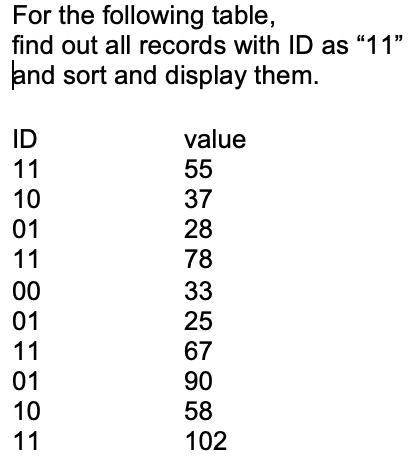

# Find Faster Clock

I came across this question from this website **rajesh52.blogspot.com**

Design a module that finds the faster clock between two different clocks. The output A\_faster\_than\_B asserts "1" when fA > fB and asserts "0" when fB > fA along with valid.

<figure><figcaption></figcaption></figure>

Followup questions:

\- How will you handle when clocks are almost the same or the same? How will you indicate the output in this case?

\- How will update the design if asked to find and indicate the frequency of the clocks?

Ideas :&#x20;

